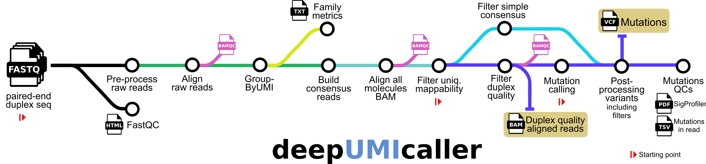

# 

<!-- 
[](https://github.com/nf-core/fastquorum/actions?query=workflow%3A%22nf-core+CI%22)
[](https://github.com/nf-core/fastquorum/actions?query=workflow%3A%22nf-core+linting%22)
[](https://nf-co.re/fastquorum/results)
[](https://doi.org/10.5281/zenodo.XXXXXXX)
-->

[](https://www.nextflow.io/)
[](https://docs.conda.io/en/latest/)
[](https://www.docker.com/)
[](https://sylabs.io/docs/)
[](https://tower.nf/launch?pipeline=https://github.com/bbglab/deepUMIcaller)

[](https://twitter.com/bbglab)
[](https://www.youtube.com/@bcnbglab)

## Introduction

**bbglab/deepUMIcaller** is a bioinformatics best-practice analysis pipeline to produce duplex consensus reads and call mutations.

The pipeline was developed from the nf-core/fasquorum pipeline that implemented the [fgbio Best Practices FASTQ to Consensus Pipeline][fgbio-best-practices-link].

The pipeline is built using [Nextflow](https://www.nextflow.io), a workflow tool to run tasks across multiple compute infrastructures in a very portable manner. It uses Docker/Singularity containers making installation trivial and results highly reproducible. The [Nextflow DSL2](https://www.nextflow.io/docs/latest/dsl2.html) implementation of this pipeline uses one container per process which makes it much easier to maintain and update software dependencies. Where possible, these processes have been submitted to and installed from [nf-core/modules](https://github.com/nf-core/modules) in order to make them available to all nf-core pipelines, and to everyone within the Nextflow community!

<!-- TODO nf-core: Add full-sized test dataset and amend the paragraph below if applicable -->

## Pipeline summary



<!-- TODO nf-core: Fill in short bullet-pointed list of the default steps in the pipeline -->
1. Read QC ([`FastQC`](https://www.bioinformatics.babraham.ac.uk/projects/fastqc/))
2. Fastq to BAM, extracting UMIs ([`fgbio FastqToBam`](http://fulcrumgenomics.github.io/fgbio/tools/latest/FastqToBam.html))
3. Align ([`bwa mem`](https://github.com/lh3/bwa)), reformat ([`fgbio ZipperBam`](http://fulcrumgenomics.github.io/fgbio/tools/latest/ZipperBam.html)), and template-coordinate sort ([`samtools sort`](http://www.htslib.org/doc/samtools.html))
4. Group reads by UMI ([`fgbio GroupReadsByUmi`](http://fulcrumgenomics.github.io/fgbio/tools/latest/GroupReadsByUmi.html))
5. Call [duplex consensus][duplex-seq-link] reads ([`fgbio CallDuplexConsensusReads`](http://fulcrumgenomics.github.io/fgbio/tools/latest/CallDuplexConsensusReads.html))
      1. Collect duplex sequencing specific metrics ([`fgbio CollectDuplexSeqMetrics`](http://fulcrumgenomics.github.io/fgbio/tools/latest/CollectDuplexSeqMetrics.html))
      2. In house plotting of single strand consensus reads family size distribution.
6. Align consensus reads([`bwa mem`](https://github.com/lh3/bwa))
7. Filter out reads with potential ambiguous mapping. (using AS-XS criteria)
8. Filter consensus reads ([`fgbio FilterConsensusReads`](http://fulcrumgenomics.github.io/fgbio/tools/latest/FilterConsensusReads.html)).
9. Variant calling ([`VarDict`](https://github.com/AstraZeneca-NGS/VarDictJava)).
10. Variant calling postprocessing. Called variants are further processed to contain more information on pileup-based recounting of allele depths, proportion of Ns per position filters and optionally filtering mutations per position. All filters are annotated in the FILTER field but no variant is discarded from the VCF.
11. Plotting of somatic variants. Plotting mutations per position in read as a QC to look for enrichment and plotting mutational profile as well.
12. (optional) Variant annotation ([`Ensembl VEP`](https://www.ensembl.org/info/docs/tools/vep/index.html)).
13. Present QC for all the metrics computed in the process ([`MultiQC`](http://multiqc.info/)).

## Initial requirements

1. Install [`Nextflow`](https://www.nextflow.io/docs/latest/getstarted.html#installation) (`>=25.04.2`)

2. Install any of [`Docker`](https://docs.docker.com/engine/installation/), [`Singularity`](https://www.sylabs.io/guides/3.0/user-guide/) (you can follow [this tutorial](https://singularity-tutorial.github.io/01-installation/)), [`Podman`](https://podman.io/), [`Shifter`](https://nersc.gitlab.io/development/shifter/how-to-use/) or [`Charliecloud`](https://hpc.github.io/charliecloud/) for full pipeline reproducibility _(you can use [`Conda`](https://conda.io/miniconda.html) both to install Nextflow itself and also to manage software within pipelines. Please only use it within pipelines as a last resort; see [docs](https://nf-co.re/usage/configuration#basic-configuration-profiles))_.

## Credits

[bbglab/deepUMIcaller](https://github.com/bbglab/deepUMIcaller) was written mainly by [Ferriol Calvet](https://github.com/FerriolCalvet) and [Miquel L. Grau](https://github.com/migrau), with contributions from [Raquel Blanco](https://github.com/rblancomi) and [Marta Huertas](https://github.com/m-huertasp)

Starting from the [nf-core/fastquorum](https://github.com/nf-core/fastquorum) pipeline at commit 09a6ae27ce917f2a4b15d2c5396acb562f9047aa. This was originally written by [Nils Homer](https://github.com/nh13). This original pipeline implemented the [fgbio Best Practices FASTQ to Consensus Pipeline][fgbio-best-practices-link].

## Documentation

For extensive documentation of the different running modes of the pipeline and more details on which are the requirements check the [usage section of the documentation](docs/usage.md).

Find a detailed explanation of the deepUMIcaller pipeline and its use within the DeepClone protocol for the analysis of duplex sequencing data here:

> **DeepClone, an end-to-end protocol to study somatic mutagenesis and selection at high resolution.**
> 
> Ferriol Calvet, Morena Pinheiro-Santin, Erika Lopez-Arribillaga, Raquel Blanco Martinez-Illescas, Núria Samper, Miguel L. Grau, Ferran Muiños, Rocío Chamorro González, Maria Andrianova, Federica Brando, Stefano Pellegrini, Marta Huertas, Elisabet Figuerola-Bou, Coohleen Coombes, Brendan F. Kohrn, Jeanne Fredrickson, Rosa Ana Risques, Nuria Lopez-Bigas, Abel Gonzalez-Perez.
>
> protocols.io (2026) https://dx.doi.org/10.17504/protocols.io.dm6gp1jodgzp/v2

For information on the [read structures](https://github.com/fulcrumgenomics/fgbio/wiki/Read-Structures) as required in the input sample sheet, check this link.

## Acknowledgements

<a href="https://fulcrumgenomics.com">
  
</a>

<a href="http://nf-co.re">
  
</a>

## Publications

> **Sex and smoking bias in the selection of somatic mutations in human bladder**
>
> Ferriol Calvet*, Raquel Blanco Martinez-Illescas*, Ferran Muiños, Maria Tretiakova, Elena S. Latorre-Esteves, Jeanne Fredrickson, Maria Andrianova, Stefano Pellegrini, Axel Rosendahl Huber, Joan Enric Ramis-Zaldivar, Shuyi Charlotte An, Elana Thieme, Brendan F. Kohrn, Miguel L. Grau, Abel Gonzalez-Perez, Nuria Lopez-Bigas & Rosa Ana Risques
>
>_Nature_ (2025) doi:[10.1038/s41586-025-09521-x](https://doi.org/10.1038/s41586-025-09521-x)
>
> *these authors contributed equally and the order was decided randomly

> **DeepClone, an end-to-end protocol to study somatic mutagenesis and selection at high resolution.**
> 
> Ferriol Calvet, Morena Pinheiro-Santin, Erika Lopez-Arribillaga, Raquel Blanco Martinez-Illescas, Núria Samper, Miguel L. Grau, Ferran Muiños, Rocío Chamorro González, Maria Andrianova, Federica Brando, Stefano Pellegrini, Marta Huertas, Elisabet Figuerola-Bou, Coohleen Coombes, Brendan F. Kohrn, Jeanne Fredrickson, Rosa Ana Risques, Nuria Lopez-Bigas, Abel Gonzalez-Perez.
>
> protocols.io (2026) https://dx.doi.org/10.17504/protocols.io.dm6gp1jodgzp/v2

## Citations

An extensive list of references for the tools used by the pipeline can be found in the [`CITATIONS.md`](CITATIONS.md) file.

You can cite the `nf-core` publication as follows:

> **The nf-core framework for community-curated bioinformatics pipelines.**
>
> Philip Ewels, Alexander Peltzer, Sven Fillinger, Harshil Patel, Johannes Alneberg, Andreas Wilm, Maxime Ulysse Garcia, Paolo Di Tommaso & Sven Nahnsen.
>
> _Nat Biotechnol._ 2020 Feb 13. doi: [10.1038/s41587-020-0439-x](https://dx.doi.org/10.1038/s41587-020-0439-x).

[fgbio-best-practices-link]: https://github.com/fulcrumgenomics/fgbio/blob/main/docs/best-practice-consensus-pipeline.md
[duplex-seq-link]: https://en.wikipedia.org/wiki/Duplex_sequencing

## Downstream methods

### Clonal selection analysis via deepCSA

If you are running deepUMIcaller with the goal of analyzing clonal selection in a given set of samples, then you can use [deepCSA](https://https://github.com/bbglab/deepCSA) as the next downstream step.

The repo contains a detailed explanation of the usage and outputs that it will provide, but here we list which files from deepUMIcaller need to be used for then running deepCSA.

Find a default template for running deepCSA inside the pipeline_info directory that is part of the output.

```csv
sample,vcf,bam
sample1,.../mutations_vcf/<sample1>.vcf,.../duplex_reads_bam/<sample1>.bam
sample2,.../mutations_vcf/<sample2>.vcf,.../duplex_reads_bam/<sample2>.bam
sample3,.../mutations_vcf/<sample3>.vcf,.../duplex_reads_bam/<sample3>.bam
```

### Duplex sequencing metrics compilation & analysis

deepUMIcaller generates a rich set of duplex sequencing metrics that allow the users to assess the performance of the duplex libraries that are being analyzed.

This is useful for compiling the metrics and being able to compare across samples & experiments and identify any patterns of variable performance that could lead to actionable decisions.

One of these decisions is to request for more sequencing output for some of the libraries, with the family size distribution curves the user can assess how appropriately sequenced was a given library and then decide if more Gbs are required. We provide an estimation of the optimal sequencing and the approximate amount of giga-bases/reads that would need to be sequenced.
